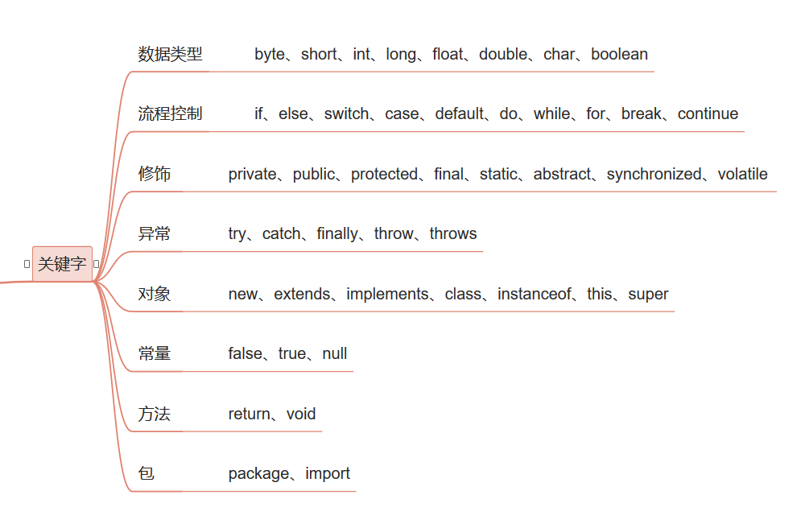
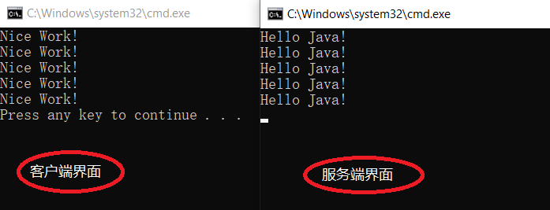

## 选择/填空/判断题知识点
### Java 的关键字

<!--more-->
说明：上图是根据书上内容总结的。在[Java文档](https://docs.oracle.com/javase/tutorial/java/nutsandbolts/_keywords.html)中有特别提到：
> `true`, `false`, and `null` might seem like keywords, but they are actually literals; you cannot use them as identifiers in your programs.

这三个实际上不是关键字，而是字面量
### 继承的知识点
* Java不支持多重继承
* extends子句格式如下
```java
class SubClass extends SuperClass{
}
```
* 子类可以继承父类中访问权限设定为public、protected、default的成员变量和方法，但是不能继承访问权限为private的成员变量和方法。
* Java中的所有的类最终都是对java.lang.Object类的扩展。
* 如果没有调用父类的构造方法，Java将自动调用它，在子构造方法的首行执行。
* 如果不存在(没有参数的)父类构造方法，并且也没有在子类构造方法首行调用其他的(父类)构造方法，这个类将不能编译。
* 子类通过成员变量的隐藏和方法的重写可以把父类的状态和行为改变为自身的状态和行为。

### 实现的知识点
* implements 实现格式：
```java
class Calculate extends Computer implements Summary,Substractable{
...
}
```
* 实现一个接口，必须实现该接口的所有方法。

### Import
* import语句用来引入所需要的类
* import语句格式
```java
import package1[.package2...].(classname|*);
```
package1.package2表示文件目录，classname指明要引入的类，`*`可以代表该目录下所有类（不包括子目录）
* Java编译器自动引入包java.lang

### Try/Catch/Final的运行流程
捕获异常语法：
```java
try{
...
}catch(Exception1 e){
...
}catch(Exception2 e){
...
}finally{
...
}
```
先执行try中的语句，当异常对象抛出时，catch语句从上至下逐个匹配，当捕获一个异常时，剩下的catch语句就不再匹配，执行catch块中的语句。try块中无论是否发生异常，最终都将执行finally语句。
### float/int/char/byte/double等类型

这些都属于Java的数据类型中的基本类型，基本类型还包括布尔类型（boolean）。Java中的数值类型占用位数和数的范围参考下表。

| 数据类型 | 所占位数 |                    数的范围                     |
| :-----: | :-----: | :--------------------------------------------: |
|   byte  |    8    |               $-2^7\sim (2^7-1)$               |
|  short  |   16    |            $-2^{15}\sim (2^{15}-1)$            |
|   int   |   32    |            $-2^{31}\sim (2^{31}-1)$            |
|  long   |   64    |            $-2^{63}\sim (2^{63}-1)$            |
|  float  |   32    |  $3.4\times 10^{-38}\sim (3.4\times 10^{38})$  |
| double  |   64    | $1.7\times 10^{-308}\sim (1.7\times 10^{308})$ |

### break/continue
* break用于跳出一层（最近的）循环或switch语句、或跳出指定标号的语句块（必须包围break）。
* continue用于跳过一次循环，或跳过一次指定标号的循环语句。

### String加其他类型的输出结果
当Java对象与String相加时，会自动调用对象的toString方法把对象转化成字符串再与String相连接。
null对象会转化为“null”，boolean会转换为“true”或者“false”。
其他数据也转换为对应的字符串。
### 什么是整型数据、整型数据的运算方式
整型数据即Java的整数类型数据，包括整型常量和整型变量。
表示形式：

| 表示数据 |          表示方法          |       例子       |
| :-----: | :-----------------------: | :--------------: |
|  十进制  | 用0~9的数值表示，首位不能是0 |     124，-100     |
|  八进制  |          以0开头           |       0134       |
| 十六进制 |        以0x或0X开头        |      0x23FE      |
|  二进制  | 以0b开头（可以用下划线分割）  | 0b1001_1111_1111 |
| long类型 |         以l或L结尾         |       41L        |
整型变量包括byte、short、int、long四种。
整型数据采用补码存储，先计算优先级较高的运算，整型数据与整型数据运算结果也为整型数据。不同类型的数据混合运算时，会先自动转换为表达范围大的类型。
### JDK的编译和运行命令
编译命令`javac`，后面加文件名（以`.java`）结尾。中间可以加入编译选项。输入`javac -help`可以查看编译选项的帮助信息。
```
Usage: javac <options> <source files>
where possible options include:
  -g                         Generate all debugging info
  -g:none                    Generate no debugging info
  -g:{lines,vars,source}     Generate only some debugging info
  -nowarn                    Generate no warnings
  -verbose                   Output messages about what the compiler is doing
  -deprecation               Output source locations where deprecated APIs are used
  -classpath <path>          Specify where to find user class files and annotation processors
  -cp <path>                 Specify where to find user class files and annotation processors
  -sourcepath <path>         Specify where to find input source files
  -bootclasspath <path>      Override location of bootstrap class files
  -extdirs <dirs>            Override location of installed extensions
  -endorseddirs <dirs>       Override location of endorsed standards path
  -proc:{none,only}          Control whether annotation processing and/or compilation is done.
  -processor <class1>[,<class2>,<class3>...] Names of the annotation processors to run; bypasses default discovery process
  -processorpath <path>      Specify where to find annotation processors
  -parameters                Generate metadata for reflection on method parameters
  -d <directory>             Specify where to place generated class files
  -s <directory>             Specify where to place generated source files
  -h <directory>             Specify where to place generated native header files
  -implicit:{none,class}     Specify whether or not to generate class files for implicitly referenced files
  -encoding <encoding>       Specify character encoding used by source files
  -source <release>          Provide source compatibility with specified release
  -target <release>          Generate class files for specific VM version
  -profile <profile>         Check that API used is available in the specified profile
  -version                   Version information
  -help                      Print a synopsis of standard options
  -Akey[=value]              Options to pass to annotation processors
  -X                         Print a synopsis of nonstandard options
  -J<flag>                   Pass <flag> directly to the runtime system
  -Werror                    Terminate compilation if warnings occur
  @<filename>                Read options and filenames from file

```
运行命令`java`,后面加类名（不带`.java`后缀）。输入`java -h`可以查看java解释器的选项帮助信息。
```
Usage: java [-options] class [args...]
           (to execute a class)
   or  java [-options] -jar jarfile [args...]
           (to execute a jar file)
where options include:
    -d32          use a 32-bit data model if available
    -d64          use a 64-bit data model if available
    -server       to select the "server" VM
                  The default VM is server.

    -cp <class search path of directories and zip/jar files>
    -classpath <class search path of directories and zip/jar files>
                  A ; separated list of directories, JAR archives,
                  and ZIP archives to search for class files.
    -D<name>=<value>
                  set a system property
    -verbose:[class|gc|jni]
                  enable verbose output
    -version      print product version and exit
    -version:<value>
                  Warning: this feature is deprecated and will be removed
                  in a future release.
                  require the specified version to run
    -showversion  print product version and continue
    -jre-restrict-search | -no-jre-restrict-search
                  Warning: this feature is deprecated and will be removed
                  in a future release.
                  include/exclude user private JREs in the version search
    -? -help      print this help message
    -X            print help on non-standard options
    -ea[:<packagename>...|:<classname>]
    -enableassertions[:<packagename>...|:<classname>]
                  enable assertions with specified granularity
    -da[:<packagename>...|:<classname>]
    -disableassertions[:<packagename>...|:<classname>]
                  disable assertions with specified granularity
    -esa | -enablesystemassertions
                  enable system assertions
    -dsa | -disablesystemassertions
                  disable system assertions
    -agentlib:<libname>[=<options>]
                  load native agent library <libname>, e.g. -agentlib:hprof
                  see also, -agentlib:jdwp=help and -agentlib:hprof=help
    -agentpath:<pathname>[=<options>]
                  load native agent library by full pathname
    -javaagent:<jarpath>[=<options>]
                  load Java programming language agent, see java.lang.instrument
    -splash:<imagepath>
                  show splash screen with specified image
See http://www.oracle.com/technetwork/java/javase/documentation/index.html for more details.

```
### Java数据类型哪两类

基本类型和引用类型。
### Java中基本类型的内存空间，char的Unicode编码方式的内存空间，字符占多少个字节
| 数据类型 | 所占位数 |
| :-----: | :-----: |
|  char   |   16    |
|   byte  |    8    |
|  short  |   16    |
|   int   |   32    |
|  long   |   64    |
|  float  |   32    |
| double  |   64    |
注意：根据[Java官方文档](https://docs.oracle.com/javase/tutorial/java/nutsandbolts/datatypes.html)描述，boolean类型的大小并没有精确定义。
> This data type represents one bit of information, but its "size" isn't something that's precisely defined.

char的Unicode编码方式，无论中英文都是占用两个字节。
### 匿名内部类的定义、局部内部类的定义
匿名内部类定义：
```java
class Out{
	void show(){
		...
	}
}
public class Main{
	public static void main(String[] args){
		Out Annoy=new Out(){
			void show(){
				...
			}
		}
	}
}
```
局部内部类定义：
```java
class Out{
	void show(){
		...
	}
}
public class Main{
	public static void main(String[] args){
		class Inner extends Out{
			void show(){
				...
			}
		}
	}
}
```
### super的几种用法
* 访问父类被隐藏的成员变量
* 调用父类中被重写的方法
* 调用父类的构造方法

### 抽象方法和抽象类
* 用abstract关键字修饰方法和类时，分别称为抽象方法和抽象类。
* 抽象方法不含方法体。
* 如果一个类中含有抽象方法，那么这个类必为抽象类。
* 抽象类中也可以没有抽象方法。
* 抽象类不能被实例化。
* 抽象类被继承时，抽象方法必须被重写。
* 接口中的方法默认为抽象方法。

### 变量、类、方法的命名规则
变量、类、方法名均需要是合法的标识符。
Java中的标识符命名规则：

* 大小写敏感
* 没有长度限制
* 不能和关键词相同
* 不能为字面值常量（false、true、null）
* 不能包含空格，特殊符号
* 不能以数字开头
* 所含字符必须是Unicode字符集内字符

一些特殊例子：
`String String=new String("String");`
`int 五=5;`

### 接口及其修饰的关键词
接口的定义格式如下：
```java
[public] interface interfaceName [extends listOfSuperInterface]{
	...
}
```
### package
* package语句作为Java源文件的第一条语句，指明该文件中定义的类所在的包。
* Java编译器把包对应于文件系统的目录。
* 若省略了package语句，源文件中定义命名的类被隐含地认为是无名包的一部分。

### ==和equals
* 对于基本类型，==比较值是否相等。
* 对于类，==和equals都是比较对象在内存中的存放地址。
* 对于内置类（String、Date、Integer等），==比较内存地址，equals被重写（一般是比较值）。

> JAVA当中所有的类都是继承于Object这个基类的，在Object中的基类中定义了一个equals的方法，这个方法的初始行为是比较对象的内存地址。

### 什么是Java的起始类
注：起始类更通用的说法是**主类**
Java 应用程序是由若干类和接口组成的，为了使Java 应用程序能够运行，至少要有一个类含有main()主方法，因为main()主方法是Java 应用程序的入口点，Java 应用程序就是从这里开始运行的，我们把含有main()主方法的类称为Java 应用程序的主类。
main方法定义格式为：
```java
public static void main(String[] args){
	...
}
```
## 简答题
### 请简述Java集合框架中Collection和Map的区别
Collection接口是集合框架的基础，它声明所有类集合都将拥有的核心方法，主要有添加、删除、清空。
Map接口是一个存储关键字/值对的集合。给定一个关键字，可以得到它的值。关键字和值都是对象，每一对关键字/值，称为一项。关键字必须是唯一的，但值可以重复。Map接口中定义的主要方法有利用关键字获取值（get）、将项加入Map等（put）。
### 请简述Java和C++的异同
同：

* 语法类似于C++
* 均支持面向对象特性
* 均为静态显式强类型语言（即必须指定每个变量的类型、编译时即可确定变量的数据类型）

注：C++由于支持隐式类型转换，强弱界线比较模糊。

异：

* Java是完全面向对象的语言，无法定义全局变量，所有数据操作都封装在类中。
* Java中无法使用指针操作内存。
* Java中的数组使用类管理，避免数组越界。
* Java自动地进行内存管理和垃圾收集。
* C++中可以通过指针进行任意的类型转换，而Java会进行相容性检查。
* Java不支持预处理、多重继承、运算符重载、默认函数参数、goto语句
* C++性能好、Java效率高
* Java中的泛型与C++中的模板本质上截然不同。Java中的泛型是通过“类型清除”来实现的，编译器在编译时根据类型信息生成强制类型转换代码。而C++中的模板实质是一套宏指令集，编译器会对每种类型创建一份模板代码副本。

### 默认类型访问权限和保护类型访问权限有何异同？
默认类型访问权限限定在同一个类中和同一个包中，不同包中的类无法访问。
保护类型访问权限限定在同一个类、同一个包以及不同包中的子类，不同包中的非子类无法访问。
### 简述泛型的作用
泛型提供了一种编译时类型安全检查功能，并能减少类型强制转化的麻烦。使用泛型可以清除不安全的类型转化，省去进行类型转换的代码。
### 当构造一个类的实例时，Java编译器主要完成的三个步骤是什么？
第一步：对象的声明
第二步：为声明的对象分配内存
第三步：执行构造方法，进行初始化
### TCP协议和UDP协议的区别
TCP协议具有高度的可靠性，能保证数据顺利抵达目的地，且收到的字节顺序和发出顺序一致。
而UDP协议不保证通信对端存在，在丢包时不负责重发，顺序混乱时也不会自动纠正，但速度快得多。
[参考资料1](https://www.cnblogs.com/steven520213/p/8005258.html)
[参考资料2](http://read.pudn.com/downloads3/sourcecode/unix_linux/5637/TCP-IP%E8%AF%A6%E8%A7%A3%E5%8D%B71%EF%BC%9A%E5%8D%8F%E8%AE%AE/021.PDF)
[TCPIP网络协议层对应的RFC文档](https://www.cnblogs.com/svking/p/3462622.html)
[RFC文档官网](https://www.rfc-editor.org/)
[TCP协议文档](https://www.rfc-editor.org/rfc/pdfrfc/rfc793.txt.pdf)
[UDP协议文档](https://www.rfc-editor.org/rfc/pdfrfc/rfc768.txt.pdf)
### 请简述Java集合框架中迭代器和比较器的作用
迭代器：使用迭代器可以依次访问类集中的元素，迭代器是一个实现Iterator或ListIterator接口的对象。Iterator可以遍历类集中的元素，获得和删除元素。ListIterator继承Iterator，允许双向遍历列表，并可以修改。
比较器：如果需要用不同方法对元素进行排序，可以在构造集合或映射时，指定一个Comparator对象。Comparator接口定义了两种方法：compare()和equals()。compare()方法比较了两个元素，确定它们的顺序。通过创建一个比较器，可以实现元素按自定义顺序排列。
### 请简述Java中的两种异常处理机制
* 捕获异常
在Java程序运行过程中系统得到一个异常对象时，它将会沿着方法的调用栈逐层回溯，寻找处理这一异常的代码。找到能处理这一异常的方法后，运行时系统把当前异常对象交给这个方法处理，这一过程称为**捕获异常**。若找不到此方法，则运行时系统将终止。
* 声明抛出异常
在Java程序运行过程中系统得到一个异常对象时，如果一个方法并不知道如何处理所出现的异常，则可在方法声明时，声明抛出异常。

### 请简述Java异常处理中运行时异常和非运行时异常的区别
运行时异常（RuntimeException），这类异常事件的生成是很普遍的，要求程序全部对这类异常做出处理可能对程序的可读性和高效性带来不好的影响，因此Java编译器允许程序不对它们做出处理。当然，必要时也可以处理运行时异常。
非运行时异常（Exception），对于这类异常来说，如果程序不进行处理，可能会带来意想不到的结果，因此Java编译器要求程序必须捕获或声明抛弃这种异常。
[Java中的常见异常种类](https://www.cnblogs.com/cvst/p/5822373.html)
### 请简述final关键字的具体作用
* 修饰成员变量
这个成员变量就成了常量，一经赋值，无法更改。
* 修饰方法
表明该方法不能被子类覆盖。
* 修饰类
表示该类不能被继承（如String类）。

### 请简述static关键字的具体作用
* 修饰成员变量
static修饰的成员变量称为类变量或静态变量，为该类的所有对象共享。
* 修饰方法
称为静态方法或类方法，是该类所有对象共享的方法。
* 修饰代码块
形成静态代码块，代码块可以放在类内任何地方，但不能是方法内部，不能放在内部类或匿名类中。代码在类加载时按照定义顺序运行一次。

### 请简述重载的作用
方法重载就是一个类中可以有多个方法具有相同的名称，但这些方法的参数必须不同，或是返回值不同。当调用一个重载方法时，JVM自动根据当前对方法的调用形式在类的定义中匹配形式符合的成员方法。重载是Java实现（编译时）多态性的方式之一。
### 请简述重写覆盖的作用
子类通过成员变量的隐藏和方法的重写可以把父类的状态和行为改变为自身的状态和行为。一个对象可以通过引用子类的实例来调用子类的方法，这实现了（运行时）多态。
### 请简述类、抽象类、接口的不同
* 定义方式不同。抽象类需要在普通类定义前加abstract关键字，而接口通过interface关键字定义。
* 使用方法不同。类可以实例化为对象，抽象类和接口不能实例化。抽象类需要被类继承来使用，而接口需要被类实现来使用。类只能继承一个类，可以实现多个接口。
* 定义权限不同。类和抽象类中的方法需要指明修饰符，而接口中的只能定义常量和方法，常量默认具有public、static、final属性，方法默认具有public、abstract属性。抽象类和接口中均可添加非抽象的方法实现，但接口中需要用default关键字声明。

### 请对比类成员、类方法和对象成员、对象方法的区别
* 类成员和类方法需要用static关键字声明，与类联系在一起，类无需实例化即可调用，但也可通过类的实例调用。
* 类方法中不能对类的对象成员进行操作。
* 类方法中不能使用this、super

### 请简述线程创建的几种方式，还有请简述各自的优缺点。
线程创建主要有两种方法：继承Thread类或实现接口Runnable
1.继承Thread类，并覆盖run()方法，然后调用start()方法启动线程。
优点：实现简单，代码较少。
缺点：无法再继承其他类
2.实现Runnable接口中的run()方法。再创建Thread类的实例，使用构造方法初始化，再调用该实例的start()方法启动线程。
优点：还可以继承其他类
缺点：实现略微更复杂
### 请简述String中的equals的作用，用代码来解释它的功能
String中的`equals`的作用是比较当前字符串对象的实体与参数指定的字符串的实体是否相同。
例如有以下定义：
```java
String a=new String("a");
String b=new String("b");
String c=new String("a");
```
则`a.equals(b)`为`false`，而`a.equals(c)`为`true`。
注意`a==c`为`false`，因为字符串是对象，而`==`比较的是对象在内存中的地址。
## 看代码写结果
### 内部类与外部类之间的访问
```java
public class GroupTwo {
	private int count; 
	public class Student { 
		String name;
		public Student(String n1) {
			name = n1;
			count++; 
		}
		public void Output() {
			System.out.println(this.name);
		}
	}
	public void output() { 
		Student s1 = new Student("Johnson"); 
		s1.Output();
		System.out.println("count=" + this.count);
	}
	public static void main(String args[]) {
		GroupTwo g2 = new GroupTwo();
		g2.output();
	}
}
```
运行结果：
```
Johnson
count=1
```
### 内部类访问外部静态变量
```java
public class GroupThree {
	private static int count; 
	private String name; 
	public class Student {
		private int count; 
		private String name; 
		public void Output(int count) {
			count++; 
			this.count++; 
			GroupThree.count++; 
			GroupThree.this.count++; 
			System.out.println(count + " " + this.count + " " + GroupThree.count+ " " + GroupThree.this.count++);
		}
	}
	public Student aStu() {
		return new Student();
	}
	public static void main(String args[]) {
		GroupThree g3 = new GroupThree();
		g3.count = 10; 
		GroupThree.Student s1 = g3.aStu();
		GroupThree.Student s1.Output(5);
	}
}
```
运行结果：
```
6 1 12 12
```
### 构造方法的重载
```java
class Box{
	double width;
	double height;
	double depth;

	//construct clone of an object
	Box(Box ob){//pass object to constructor
		width=ob.width;
		height=ob.height;
		depth=ob.depth;
	}
	//constructor used when all dimensions specified
	Box(double w,double h,double d){
		width=w;
		height=h;
		depth=d;
	}
	//constructor used when no dimensions specified
	Box(){
		width=-1;
		height=-1;
		depth=-1;
	}
	//constructor used when cube is created
	Box(double len){
		width=height=depth=len;
	}
	//compute and return volume
	double volume(){
		return width*height*depth;
	}
}
class OverloadCons2{
	public static void main(String args[]){
		//create boxes using the various constructors
		Box mybox1=new Box(10,20,15);
		Box mybox2=new Box();
		Box mycube=new Box(7);
		Box myclone=new Box(mybox1);

		double vol;
		//get volume of first box
		vol=mybox1.volume();
		System.out.println("Volume of mybox1 is "+vol);
		//get volume of second box
		vol=mybox2.volume();
		System.out.println("Volume of mybox2 is "+vol);
		//get volume of cube
		vol=mycube.volume();
		System.out.println("Volume of cube is "+vol);
		//get volume of clone
		vol=myclone.volume();
		System.out.println("Volume of clone is "+vol);
	}
}
```
运行结果：
```
Volume of mybox1 is 3000.0
Volume of mybox2 is -1.0
Volume of cube is 343.0
Volume of clone is 3000.0
```

### 成员变量的覆盖
```java
public class Class3 {
	public static void main(String args[]) {
		SubSubClass x = new SubSubClass(10, 20, 30);
		x.show();
	}
}
class SuperClass {
	int a, b;
	SuperClass(int aa, int bb) {
		a = aa;
		b = bb;
	}
	void show() {
		System.out.println("a=" + a + "\nb=" + b);
	}
}
class SubClass extends SuperClass {
	int c;
	SubClass(int aa, int bb, int cc) {
		super(aa, bb);
		c = cc;
	}
}
class SubSubClass extends SubClass {
	int a;
	SubSubClass(int aa, int bb, int cc) {
		super(aa, bb, cc);
		a = aa + bb + cc;
	}
	void show() {
		System.out.println("a=" + a + "\nb=" + b + "\nc=" + c);
	}
}
```
运行结果：
```
a=60
b=20
c=30
```
### super关键字的使用
```java
class superClass {
	int y;
	superClass() {
		y = 30;
		System.out.println("in superClass:y=" + y);
	}
	void doPrint() {
		System.out.println("In superClass.doPrint()");
	}
}
class subClass extends superClass {
	int y;
	subClass() {
		super(); 
		y = 50;
		System.out.println("in subClass:y=" + y);
	}
	void doPrint() {
		super.doPrint(); 
		System.out.println("in subClass.doPrint()");
		System.out.println("super.y=" + super.y + "  sub.y=" + y);
	}
}
public class inviteSuper {
	public static void main(String args[]) {
		subClass subSC = new subClass();
		subSC.doPrint();
	}
}
```
运行结果：
```
in superClass:y=30
in subClass:y=50
In superClass.doPrint()
in subClass.doPrint()
super.y=30  sub.y=50
```
### 继承
```java
class SmallPlate {
  SmallPlate(int i) {
	System.out.println("Plate constructor");
  }
}
class DinnerPlate extends SmallPlate {
  DinnerPlate(int i) {
    super(i);
    System.out.println("DinnerPlate constructor");
  }
}	
class Utensil {
  Utensil(int i) {
	  System.out.println("Utensil constructor");
  }
}
class Spoon extends Utensil {
  Spoon(int i) {
    super(i);
    System.out.println("Spoon constructor");
  }
}
class Fork extends Utensil {
  Fork(int i) {
    super(i);
    System.out.println("Fork constructor");
  }
}	
class Knife extends Utensil {
  Knife(int i) {
    super(i);
    System.out.println("Knife constructor");
  }
}
// A cultural way of doing something:
class Custom {
  Custom(int i) {
	  System.out.println("Custom constructor");
  }
}	
public class PlaceSetting extends Custom {
  private Spoon sp;
  private Fork frk;
  private Knife kn;
  private DinnerPlate pl;
  public PlaceSetting(int i) {
    super(i + 1);
    sp = new Spoon(i + 2);
    frk = new Fork(i + 3);
    kn = new Knife(i + 4);
    pl = new DinnerPlate(i + 5);
    System.out.println("PlaceSetting constructor");
  }
  public static void main(String[] args) {
    PlaceSetting x = new PlaceSetting(9);
  }
}
```
运行结果：
```
Custom constructor
Utensil constructor
Spoon constructor
Utensil constructor
Fork constructor
Utensil constructor
Knife constructor
Plate constructor
DinnerPlate constructor
PlaceSetting constructor
```
## 编程题
在本机建立一个多线程的服务端，接收本机客户端的连接请求，当客户端向服务端发送“Hello Java!”，服务端回复“Nice Work!”。（要求服务端，客户端都是多线程）
服务端程序：
```java
import java.io.*;
import java.net.*;
public class Server implements Runnable{
    Socket client;
    BufferedReader in;
    PrintWriter out;
    public Server(Socket client)throws IOException{
        this.client=client;
        in=new BufferedReader(new InputStreamReader(client.getInputStream()));
        out=new PrintWriter(new BufferedWriter(new OutputStreamWriter(client.getOutputStream())),true);
    }
    public void run(){
        try{
            String str=in.readLine();
            System.out.println(str);
            out.println("Nice Work!");
            client.close();
        }catch(IOException e){}
    }
    public static void main(String[] args)throws IOException{
        ServerSocket server=new ServerSocket(1008);
        while(true){
            Socket client=server.accept();
            new Thread(new Server(client)).start();
        }
    }
}
```
客户端程序：
```java
import java.io.*;
import java.net.*;
public class Client extends Thread{
	Socket client;
	BufferedReader in;
	PrintWriter out;
	public Client()throws IOException{
		client=new Socket("127.0.0.1",1008);
		in=new BufferedReader(new InputStreamReader(client.getInputStream()));
		out=new PrintWriter(new BufferedWriter(new OutputStreamWriter(client.getOutputStream())),true);
	}
	public void run(){
		try{
			out.println("Hello Java!");
			String str=in.readLine();
			System.out.println(str);
			client.close();
		}catch(IOException e){}
	}
	public static void main(String[] args)throws IOException{
		for(int i=1;i<=5;i++){
			(new Client()).start();
		}
	}
}
```
运行结果：

